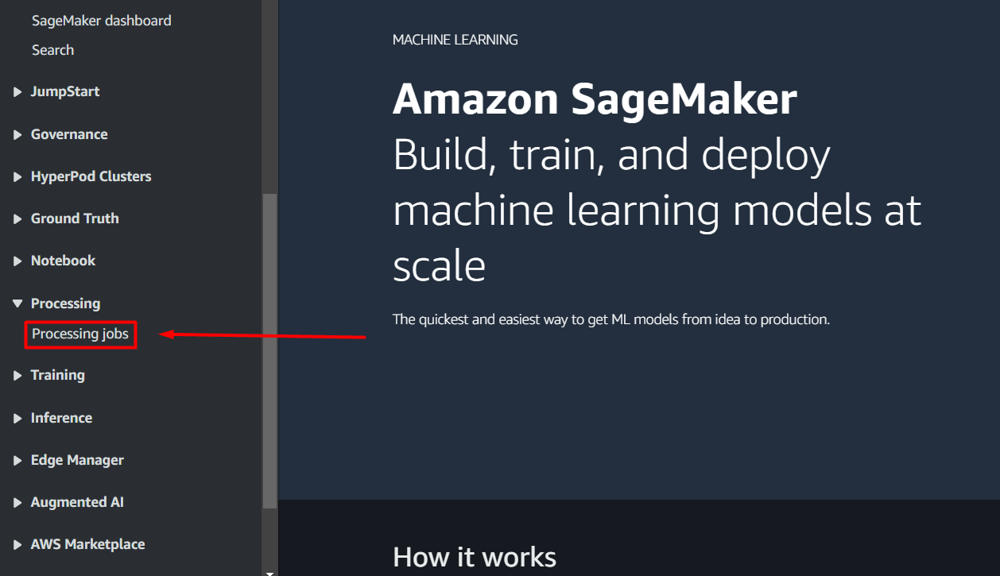

<h1 align="center">Introduction to Amazon SageMaker AI</h1>

<details>
  <summary><h2>Table of Contents</h2></summary>
  <ol>
    <li><a href="#overview">Overview</a></li>
    <li><a href="#amazon-s3">Amazon S3</a>
    <ul>
        <li><a href="#introduction">Introduction</a></li>
        <li><a href="#creating-bucket">Creating bucket</a></li>
        <li><a href="#uploading-data">Uploading data</a></li>
      </ul>
    </li>
    <li><a href="#amazon-sagemaker-ai">Amazon SageMaker AI</a>
    <ul>
        <li><a href="#processing-jobs">Processing jobs</a></li>
      </ul>
    </li>
  </ol>
</details>

## Overview
Amazon SageMaker AI is an umbrella of services that AWS provides for Machine Learning (ML). In a nutshell, it is a service that enables the developer to be much more efficient with their valuable time when developing and deploying ML models. This methodology is applicable across many learning algorithms and many production use cases.

In this exercise, you will harness some of the most commonly used microservices of SageMaker AI to contruct basic components of a machine learning workflow. By the end of this lesson, you will be able to:
* Launch a processing job to preprocess your data.
* Launch a training job and build your ML model.
* Deploy an endpoint, an API for your trained model.
* Launch a batch transform job to try out your trained model.
<p align="center"></p>

## Amazon S3
First of all, you need to create a bucket in Amazon S3 to store any future files and data.

### Introduction
Amazon Simple Storage Service (Amazon S3) is an object storage service that can store almost any object needed for machine learning. That includes datasets, model artifacts, logs, and more.

A [bucket](https://docs.aws.amazon.com/AmazonS3/latest/userguide/UsingBucket.html) is a container for objects (i.e., files) stored in S3. 

S3 supports the folder concept as a means of grouping objects. It does this by using a shared name *prefix*. In other words, the grouped objects have names that begin with a common string. This common string, or shared prefix, is the folder name. Object names are also referred to as key names.

For example: `s3://example-bucket/1/2/3/example.txt`
 * Bucket: example-bucket 
 * Prefix: 1/2/3
 * Key name: 1/2/3/example.txt

### Creating bucket
1. Head to Amazon S3 using the search bar and in the left navigation sidebar, select *General purpose buckets*.
<p align="center"></p>

2. Select *Create bucket*.
3. Enter a name for your bucket. Once created, you cannot change its name.
4. For region, select the AWS Region close to you to minimize latency and costs.
<p align="center"></p>

5. Scroll all the way down and select *Create bucket*.

Now that you have create a bucket on AWS, you can upload any files into this storage manually or through API. Furthermore, you can create folders for organization purpose. Simply go to your bucket and click *Create folder*.
<p align="center"></p>

### Uploading data
After creating bucket, you can upload data and any other files there. But right now, you need to upload all datasets in [data folder](../data) first.

1. Go to your bucket. If you have created a folder within your bucket and want to upload there instead, then click at the folder to open it up.
2. Select *Upload*.
<p align="center"></p>

3. From here, you can drag and drop files or/and folders you want to upload into the website, or you can select *Add files* or *Add folder*.
<p align="center"></p>

4. Select *Upload* at the bottom when all set.

## Amazon SageMaker AI
After uploading necessary files, the next thing to do is training a machine learning model and making use of it to produce inferences. This is the most important part as you will perform common machine learning operations on AWS.

Step by step, you will create a model that predicts the usefulness of a product review, given only the text. This is an example of a problem in the domain of supervised sentiment analysis.

### Processing jobs
First of all, you need the input data in order to train the model. The [dataset](../data/reviews_Toys_and_Games_5.json.zip) you will be working with is a collection of reviews for an assortment of toys and games found on Amazon. It includes, but is not limited to, the text of the review itself as well as the number of user votes on whether or not the review was helpful.

However, the dataset is inside the .zip file so you have to extract it before proceeding. Moreover, the dataset is a file containing a single JSON object per line representing a review with the following format: 
```JSON
{
 "reviewerID": "<string>",
 "asin": "<string>",
 "reviewerName": "<string>",
 "helpful": [
   <int>, (indicating number of helpful votes)
   <int>  (indicating total number of votes)
 ],
 "reviewText": "<string>",
 "overall": <int>,
 "summary": "<string>",
 "unixReviewTime": <int>,
 "reviewTime": "<string>"
}
```
Later, you will be using [BlazingText algorithm](https://docs.aws.amazon.com/sagemaker/latest/dg/blazingtext.html) in training process, which is an implemention of [Word2Vec algorithm](https://en.wikipedia.org/wiki/Word2vec) optimized for SageMaker AI. Therefore, in order for this algorithm to work, you have to format the input data correctly. It should contain a label, followed by a sentence, per line. Labels must be prefixed by the string `__label__`. 

For the dataset in this exercise, you will extract the text from the field *reviewText* and generate label based on the field *helpful* for each review. If the majority of votes is helpful, assign it `__label__1`, otherwise `__label__2`. If there is no majority or the review text is empty, drop the review from consideration. Then, cut the text into individual sentences, while ensuring that each sentence retains the original label from the review. When splitting using the character ".", make sure that no empty sentences are created, since reviews usually contain an ellipsis "..." or more. Your input data should look something like this:

```
__label__1 Even if you can only play with one other person, you'll want to pull Stone Age out often
__label__1 But if you have friends to join you, this game will be on the table a lot
__label__2 It's a fun game but not a favorite
__label__2 I prefer more complex games
__label__2 If you're new to gaming or like relatively simple games I recommend you try this
```

Finally, it is your responsibility is to split the dataset into training set and testing set. Training set should represent 80% of the dataset, while the rest is testing set. Make sure that they don't overlap.

All of the procedures mentioned above and more are collectively called *data pre-processing*, the first and most crucial step in any machine learning project. To do all of that in AWS, follow these steps:
1. Navigate to Amazon SageMaker AI.
2. In the left navigation sidebar, go to *Processing* → *Processing jobs*.
<p align="center"></p>

3. Click on *Create processing job* button.
<p align="center"></p>

1. In the *Job name* field, enter a unique name for your processing job.
2. In the *Container* field, enter registry path of a processing image stored in Amazon ECR. For this exercise, you will use scikit-learn's image.\
To find the registry path, go to [Docker Registry Paths and Example Code](https://docs.aws.amazon.com/sagemaker/latest/dg-ecr-paths/sagemaker-algo-docker-registry-paths.html). On the left navigation sidebar, choose the AWS region that you're logging in. Then, scroll down to *Scikit-learn (algorithm)* section, you will find the registry path and the version associated. Replace `<tag>` with `[version]-cpu-py3`. For example, if you choose version 1.2-1, your registry path will be `683313688378.dkr.ecr.us-east-1.amazonaws.com/sagemaker-scikit-learn:1.2-1-cpu-py3`\
See the illustration below.
<p align="center"></p>

1. Implement a Python script to unzip, format, and split the raw dataset as instructed earlier, or you can go ahead and use [hello_blaze_preprocess.py](hello_blaze_preprocess.py) provided. After that, upload the script to your S3 bucket. \
If you decide to custom your own script, note that the processing job will copy the dataset from S3 to a local directory, prefixed with `/opt/ml/processing/`, within the container. Thus, your script should take the dataset in this directory as input instead. Additionally, it must output training set and testing set to specified local directories, also prefixed with `/opt/ml/processing/`. You will have a chance to set up these local directories in the next steps.
<p align="center"></p>

1. Go to the *Input data configuration* field. Then specify the local path that the dataset will be downloaded into, e.g. `/opt/ml/processing/input/data`, and enter the S3 location (S3 URI) of the dataset.
<p align="center"></p>

1. Click on *Add input* and specify the local path, e.g. `/opt/ml/processing/input/code`, and the S3 location of your Python code.
2.  Go to the *App Specification* field. Then add `python3` as the first entrypoint and the local address to your Python script, e.g. `/opt/ml/processing/input/code/<your_script_name>`, as the second. If you use the provided script, you need to add the name of the dataset as a container argument.
<p align="center"></p>

1.  In the *Output data configuration* field, enter the local path where your Python script saves the training set and the S3 location where you want SageMaker AI to upload.
2.  Click on *Add input* and do the similar process for the testing set.
<p align="center"></p>

1.   Select *Submit* at the bottom when all set.

Wait for a few minutes to see the processing job executed successfully or not. It it failed, click on its name, scroll down to *Monitoring* section, and select *View logs* to investigate the cause of failure. If it succeeded, you should be able to see the training set and testing set in your S3 bucket.


