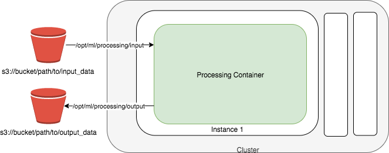
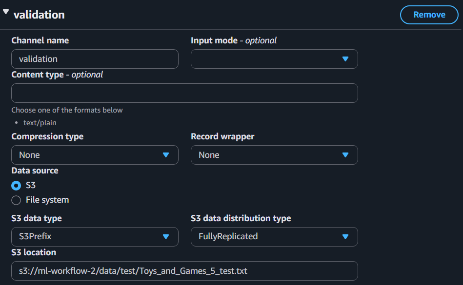
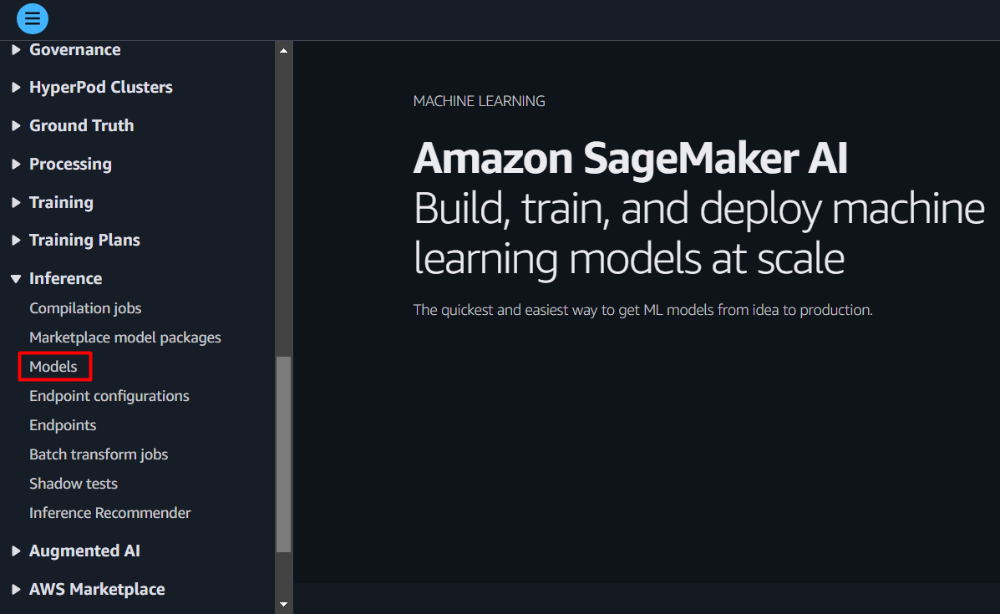
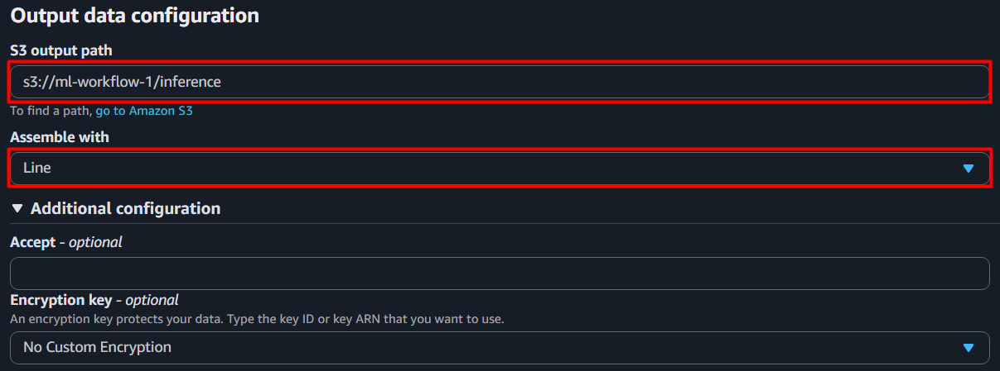

<h1 align="center">Introduction to Amazon SageMaker AI</h1>

<details>
  <summary><h2>Table of Contents</h2></summary>
  <ol>
    <li><a href="#overview">Overview</a></li>
    <li><a href="#amazon-s3">Amazon S3</a>
    <ul>
        <li><a href="#introduction">Introduction</a></li>
        <li><a href="#creating-bucket">Creating bucket</a></li>
        <li><a href="#uploading-data">Uploading data</a></li>
    </ul>
    </li>
    <li><a href="#amazon-sagemaker-ai">Amazon SageMaker AI</a>
    <ul>
        <li><a href="#processing-jobs">Processing jobs</a></li>
        <li><a href="#training-jobs">Training jobs</a></li>
        <li><a href="#endpoints">Endpoints</a></li>
        <li><a href="#batch-transform-jobs">Batch transform jobs</a></li>
    </ul>
    </li>
    <li><a href="#cloudwatch-logs">CloudWatch Logs</a></li>
    <li><a href="#epilogue">Epilogue</a></li>
  </ol>
</details>

## Overview
Amazon SageMaker AI is an umbrella of services that AWS provides for Machine Learning (ML). In a nutshell, it is a service that enables the developer to be much more efficient with their valuable time when developing and deploying ML models. This methodology is applicable across many algorithms and many production use cases.

In this tutorial, you will harness some of the most commonly used microservices of SageMaker AI to contruct basic components of a machine learning workflow. By the end of this tutorial, you will be able to:
* Launch a processing job to preprocess your data.
* Launch a training job and build your ML model.
* Deploy an endpoint to serve as an API for your trained model.
* Launch a batch transform job to try out your trained model.
<p align="center"></p>

## Amazon S3
First of all, you need to create a bucket in Amazon S3 to store any future files and data.

### Introduction
Amazon Simple Storage Service (Amazon S3) is an object storage service that can store almost any object needed for machine learning. That includes datasets, model artifacts, logs, and more.

An [S3 bucket](https://docs.aws.amazon.com/AmazonS3/latest/userguide/UsingBucket.html) is a container for objects (i.e., files) stored in S3. 

S3 supports the folder concept as a means of grouping objects. It does this by using a shared name *prefix*. In other words, the grouped objects have names that begin with a common string. This common string, or shared prefix, is the folder name. The prefix must end with a forward slash character `/` to indicate folder structure. Furthermore, object names are also referred to as key names.

For example: `s3://example-bucket/1/2/3/example.txt`
 * Bucket: `example-bucket`
 * Prefix: `1/2/3/`
 * Key name: `1/2/3/example.txt`

### Creating bucket
1. Head to Amazon S3 using the search bar and in the left navigation sidebar, select *General purpose buckets*.
<p align="center"></p>

2. Select *Create bucket*.
3. Enter a name for your bucket. It must be globally unique accross all AWS accounts. Once created, you cannot change its name.
4. Select the AWS Region your account is logging in. Additionally, remeber this region because it is going to be very important later.
<p align="center"></p>

5. Scroll all the way down and select *Create bucket*.

Now that you have created a bucket on AWS, you can upload any files into this storage manually or through API. Furthermore, you can create folders to help organize your files more effectively. Simply go to your bucket and click *Create folder*.
<p align="center"></p>

### Uploading data
After creating bucket, you can upload data and any other files there. But right now, you need to upload the dataset [`reviews_Toys_and_Games_5.json.zip`](../data/reviews_Toys_and_Games_5.json.zip).

1. Go to your bucket. If you have created a folder within your bucket and want to upload there instead, then click at the folder to open it up.
2. Select *Upload*.
<p align="center"></p>

3. From here, you can drag and drop files or/and folders you want to upload into the website, or you can select *Add files* or *Add folder*.
<p align="center"></p>

4. Select *Upload* at the bottom when all set.

## Amazon SageMaker AI
After uploading necessary files, the next thing to do is training a machine learning model and making use of it to produce inferences. This is the most important part as you will perform common machine learning operations on AWS.

Step by step, you will create a model that predicts the usefulness of a product review, given only the text. This is an example of a problem in the domain of supervised sentiment analysis.

### Processing jobs
Before training a model, you need input data. The [dataset](../data/reviews_Toys_and_Games_5.json.zip) you will be working with is a collection of reviews for an assortment of toys and games found on Amazon. It includes, but is not limited to, the text of the review itself as well as the number of user votes on whether or not the review was helpful.

However, the dataset is inside a .zip file so you have to extract it before proceeding. Moreover, the dataset is a file containing a single JSON object per line representing a review with the following format: 
```JSON
{
 "reviewerID": "<string>",
 "asin": "<string>",
 "reviewerName": "<string>",
 "helpful": [
   <int>, (indicating number of helpful votes)
   <int>  (indicating total number of votes)
 ],
 "reviewText": "<string>",
 "overall": <int>,
 "summary": "<string>",
 "unixReviewTime": <int>,
 "reviewTime": "<string>"
}
```

Later, you will be using [BlazingText algorithm](https://docs.aws.amazon.com/sagemaker/latest/dg/blazingtext.html) in training process, which is an implemention of [Word2Vec algorithm](https://en.wikipedia.org/wiki/Word2vec) optimized for SageMaker AI. Therefore, in order for this algorithm to work, you have to format the input data correctly. This is true for any other algorithm or model you work with, as each of them requires a particular type and structure of the input data. In this case, the data should only consist of plain text, with each line containing a label name followed by a sentence. Labels must be prefixed by the string `__label__`. 

For the dataset in this exercise, you will extract the text from the field *reviewText* and generate label based on the field *helpful* for each review. If the majority of votes is helpful, assign it `__label__1`, otherwise `__label__2`. If there is no majority or the review text is empty, drop the review from consideration. Then, cut the text into individual sentences, while ensuring that each sentence retains the original label from the review. When splitting using the character `.`, make sure that no empty sentences are created, since reviews usually contain an ellipsis `...` or more. Your input data should look something like this:
```
__label__1 Even if you can only play with one other person, you'll want to pull Stone Age out often
__label__1 But if you have friends to join you, this game will be on the table a lot
__label__2 It's a fun game but not a favorite
__label__2 I prefer more complex games
__label__2 If you're new to gaming or like relatively simple games I recommend you try this
```

Finally, it is your responsibility is to split the dataset into training set and testing set. Training set should represent 80% of the dataset, while the rest is testing set. Make sure that they don't overlap.

All of the procedures mentioned above and more are collectively called *data pre-processing*, the first and most crucial step in any machine learning project. To do all of that, follow these steps:
1. Navigate to Amazon SageMaker AI. In the left navigation sidebar, go to *Processing* → *Processing jobs*.
<p align="center"></p>

2. Click on *Create processing job* button.
<p align="center"></p>

3. In the *Job name* field, enter a unique name for your processing job.
4. Under *IAM role* field, click on the dropdown menu and select *Create a new role* for operating SageMaker AI and S3 if you don't have one or this is your new experience. Select *Any S3 bucket* and then select *Create role*.
<p align="center"></p>

5. In the *Container* field, enter registry path of a processing image stored in Amazon ECR. For this exercise, you will use scikit-learn's image.\
To find the registry path, go to [Docker Registry Paths and Example Code](https://docs.aws.amazon.com/sagemaker/latest/dg-ecr-paths/sagemaker-algo-docker-registry-paths.html). On the left navigation sidebar, choose the AWS region that you're logging in. Then, scroll down to *Scikit-learn (algorithm)* section, you will find the registry path and the version associated. Replace `<tag>` with `[version]-cpu-py3`. For example, if you choose version 1.2-1, your registry path will be `683313688378.dkr.ecr.us-east-1.amazonaws.com/sagemaker-scikit-learn:1.2-1-cpu-py3`
<p align="center"></p>

6. Implement a Python script to unzip, format, and split the raw dataset as previously instructed, or you can go ahead and use [hello_blaze_preprocess.py](hello_blaze_preprocess.py) provided. After that, upload the script to your S3 bucket. \
If you decide to custom your own script, note that the processing job will copy the dataset from S3 to a local directory, prefixed with `/opt/ml/processing/`, within the container. Thus, your script should take the dataset in this directory as input instead. Additionally, it must output training set and testing set to specified local directories, also prefixed with `/opt/ml/processing/`. You will have a chance to set up these local directories in the next steps.
<p align="center"></p>

7. Go to the *Input data configuration* field. Then enter the local path that the dataset will be downloaded into, e.g. `/opt/ml/processing/input/data`, and the S3 location (S3 URI) of the dataset.
<p align="center"></p>

8. Click on *Add input* and specify the local path, e.g. `/opt/ml/processing/input/code`, and the S3 location of your Python script.
9. Go to the *App Specification* field. Then add `python3` as the first entrypoint and the local address to your Python script, e.g. `/opt/ml/processing/input/code/<your_script_name>`, as the second. If you use the provided code, you need to add the name of the dataset as a container argument. \
Under the hood, the processing job will execute a command line based on this setting to run your script within the container. Something like this:
```
python3 /opt/ml/processing/input/code/hello_blaze_preprocess.py review_Toys_and_Games.json.zip
```
<p align="center"></p>

10. In the *Output data configuration* field, enter the local path where your Python script saves the training set and the S3 location where you want SageMaker AI to upload.
11. Click on *Add output* and do the similar process for the testing set.
<p align="center"></p>

12. Select *Submit* at the bottom when all set.

Wait for a few minutes to see if your processing job executed successfully or not. It it failed, click on its name, scroll down to *Monitoring* section, and select *View logs* to investigate the cause of failure. Once the issue is identified and fixed, try again with a new processing job. If it succeeded, you should be able to see the training set and testing set in your S3 bucket.
<p align="center"></p>

Your input data is now ready for use in training. Let's move to the next section.

### Training jobs
A training job in SageMaker AI is a managed execution of training a machine learning algorithm. You simply provide the dataset and configure the training job with the necessary parameters. SageMaker AI will take care of running the training process. When the job has completed, the resulting model artifact will be stored in the S3 location you specified.

A model artifact is a package generated by a training job. This packaged model contains the information of parameters learned from the training process and instructions on how to effectively perform predictions, known as *inference*.

After you successfully pre-processed your dataset, it is time to train a model with it. As mentioned earlier, you will use the BlazingText algorithm provided by SageMaker AI as your model. So to launch a training job with this algorithm, do the following:
1. Navigate to Amazon SageMaker AI. In the left navigation sidebar, go to *Training* → *Training jobs*.
<p align="center"></p>

2. Click on *Create training job* button.
3. Enter a unique name for your training job.
4. Under *IAM role*, select the same role as your previous processing jobs.
5. Select *Amazon SageMaker built-in algorithm* for *Algorithm source* and select *Text Classification & Text Embedding - Blazing Text* as your algorithm. Make sure the *Input mode* is *File*.
<p align="center"></p>

6. Under *Resource configuration*, select *ml.m5.large* for *Instance type* and specify 5GB of additional memory.
7. Under *Stopping condition*, set *Maximum runtime* to 10 minutes. The training job will automatically stop if it exceeds this time limit. It is important that you set runtime limit for your training job because if it takes a long time, you will be charged more.
<p align="center"></p>

8. In the *Hyperparameters* field, set *mode* to *supervised*.
<p align="center"></p>

9. In the *Input data configuration* field, enter the S3 path to your training set. Since the chosen algorithm only works with one type of data, plain text, you don't have to specify the content type of your data. But if you work with other algorithms, pay attention to this in their documentation, as they may have different data format options to select.
10. Click on *Add channel* and enter the S3 path to your testing set. Type `validation` for the *Channel name*.
<p align="center"></p>

11. In the *Output data configuration* field, enter the S3 path where you want SageMaker AI to output your model artifact.
12. All done. Click on *Create training job* to finish setting.

The training job should complete within 10 minutes and then you will be able to find the model artifact generated by the job in your S3 bucket. The model is being compressed inside a .tar.gz file. If your training job fails, it is mostly due to incorrectly formatted input data or misconfiguration in the setup.

Exciting! Your model is now ready to deploy and use in production.

### Endpoints
In SageMaker AI, an endpoint serves as an Application Programming Interface (API) to a deployed model in production. It provides a [RESTful interface](https://aws.amazon.com/what-is/restful-api/) that allows you to send user data to the model and receive predictions in response, enabling real-time inference.

To deploy a model, first you have to create a model object in SageMaker AI from a model artifact:
1. Navigate to Amazon SageMaker AI.
2. In the left navigation sidebar, go to *Inference* → *Models*.
<p align="center"></p>

3. Click on *Create model* button.
4. Give a unique name for your model object.
5. Under *IAM role*, select the same role as your previous training jobs.
6. Under *Container input options*, select *Provide model artifacts and inference image location*.
7. Under *Model Compression Type*, select *CompressedModel* and *Use a single model*.
8. Enter registry path where container image of your model, *BlazingText*, is stored in Amazon ECR.\
To find it, go to [Docker Registry Paths and Example Code](https://docs.aws.amazon.com/sagemaker/latest/dg-ecr-paths/sagemaker-algo-docker-registry-paths.html). On the left navigation sidebar, choose the AWS region that you're logging in. Then, scroll down to *BlazingText (algorithm)* section, you will find the registry path and the version associated. Replace `<tag>` with version number you choose.
<p align="center"></p>

9. Enter the S3 location of your model artifacts
<p align="center"></p>

10. Scroll down and click on *Create model* button.

Now that you have a model object in SageMaker AI, let's deploy it with an endpoint:
1. Select the model you want to deploy (don't click on its name) and click on *Create endpoint* button.
<p align="center"></p>

2. Enter a unique name for your endpoint.
3. If you have an existing endpoint configuration for your trained model, then use it and create an endpoint right away. Otherwise, create new one and follow the next steps.
4. Specify a unique name for your new endpoint configuration.
5. Under *Type of endpoint*, select *Provisioned*.
<p align="center"></p>

6. If you want your endpoint to handle prediction request asynchronously, turn on *Async Invocation Config* and provide neccessary information. If you also want your endpoint to save prediction request and response, switch *Enable data capture* on and fill in neccessary information. \
Otherwise, click on *Create endpoint configuration* and then *Create endpoint* at the bottom.

Wait for a few moment. Once the endpoint status changes to *InService*, you can then interact with it and make real-time predictions on new data. This can be done through AWS SDK, such as `boto3` or `sagemaker` modules in Python, which is covered in [SDK tutorial](sdk-tutorial.ipynb). Alternatively, you can integrate your endpoint with other AWS services like AWS Lambda and AWS Step Functions, which will be covered in the next tutorial.

When sending a prediction request to your endpoint, check if the input data adheres to the inference data format accepted by the algorithm you are using. It is highly recommended to consult the documentation of your select algorithm for the data format requirements and other important information. 

For BlazingText algorithm, the inference data requires a different structure from the training data, as found in [its documentation](https://docs.aws.amazon.com/sagemaker/latest/dg/blazingtext.html). You need to send a prediction request in the form of JSON object and indicate the content type of the request, which is `application/json`.

<ins>**Please note**</ins>: Creating an endpoint and keeping it active **does incur costs** on your AWS account, even if it's idle. To avoid unwanted charges, delete any endpoint right after you finish your experiment, or when you are stepping away.

### Batch transform jobs
Batch Transform is a compute job that performs inference using your trained model on large datasets. A batch transform job is ideal for large-scale predictions where low latency is not a priority. This differs from an endpoint in that endpoints service real-time, individual user requests for inference over time.

To deploy a model with a batch transform job:
1. Navigate to Amazon SageMaker AI.
2. In the left navigation sidebar, go to *Inference* → *Batch transform jobs*.
<p align="center"></p>

3. Click on *Create batch transform job* button.
4. Give a unique name for your batch transform job.
5. Click on *Find model* and select the model you want to deploy. If you haven't created a model object in SageMaker AI or you want to have a new one, go back to the previous section for guidance.
<p align="center"></p>

6. Select *ml.m5.large* for *Instance type* and enter `1` for *Instance count*.
7. In the *Input data configuration* field, select *Line* for *Split type*. This tells SageMaker AI to break and process the input file line by line, which can paralellize the job and improve performance.
8. Enter `application/json` for *Content type*, as this is the required data format for inference by BlazingText algorithm. Another acceptable format is `application/jsonlines`. If you are using a trained model from a different algorithm, be sure to check and specify correctly the required input format for inference in its documentation.
9. Create a .json file to be your inference data and write down a list of custom review sentences, as many as you like, in the following format: 
```JSON
{
  "instances": [
    "Review sentence #1.",
    "Review sentence #2.",
    "Review sentence #3.",
    ...
  ]
}
```
10. Upload your inference data to your S3 bucket and enter its S3 location in the configuration.
<p align="center"></p>

11. In the *Output data configuration* field, enter the S3 path where the prediction result will be located. Then, select *Line* for *Assemble with* to assemble the predictions into a single output file after the input file has been processed line by line.
<p align="center"></p>

12. Click on *Create job* button at the bottom.

Within a few minutes, your batch transform job will be done and you can find the result in your S3 bucket. It's an .out file containing a label prediction associated with a probability for each review sentence. Open it as a text file and you will see. If the job failed, please double-check its configuration and the format of your inference data.

You may notice how poorly the model performs text classification. Since this tutorial only focuses on using microservices of SageMaker AI, it does not go over any tips on how to improve your model. For that, you may need to train a new model with fine-tuned [hyperparameters](https://docs.aws.amazon.com/sagemaker/latest/dg/blazingtext_hyperparameters.html#blazingtext_hyperparameters_text_class) or with a different algorithm. Finally, always read the documentation of the algorithm you are working with to minimize error and understand its hyperparameters. For a list of built-in algorithms of AWS and their documentation, click [here](https://docs.aws.amazon.com/sagemaker/latest/dg/algos.html).

## CloudWatch Logs
CloudWatch Logs is the log repository of your compute resources in AWS, including those used by SageMaker AI. In practice, configuring and managing in cloud services is difficult and error-prone. This is where CloudWatch Logs comes in handy. It helps you identify and troubleshoot the cause of error in a AWS service.

Log into your AWS Console and navigate to CloudWatch through the search bar. After that, go to *Logs* → *Log groups* and you can see log group of every AWS service you've worked with so far. You can diagnose issues of a SageMaker AI job from there.
<p align="center"></p>

Alternatively, you can go to the detail of a failed job and click on *View logs* from the field *Monitoring* or *Monitor*. This takes you to the relevant log stream in CloudWatch, allowing you to quickly inspect error messages.
<p align="center"></p>
<p align="center"></p>

## Epilogue
Congratulations! You have successfully completed the first milestone. 

As a best practice, __remember to delete or turn off__ any cost-consuming instances in AWS SageMaker AI. Moreover, you are encouraged to practice what you have learned so far to a different use case.

Throughout a machine learning model development, creating a seperate job in SageMaker AI for each phase is tiresome and inefficient. Fortunately, AWS provides a way to automate and orchestrate these steps into a single, streamlined workflow. Let's jump to the next tutorial and find out.