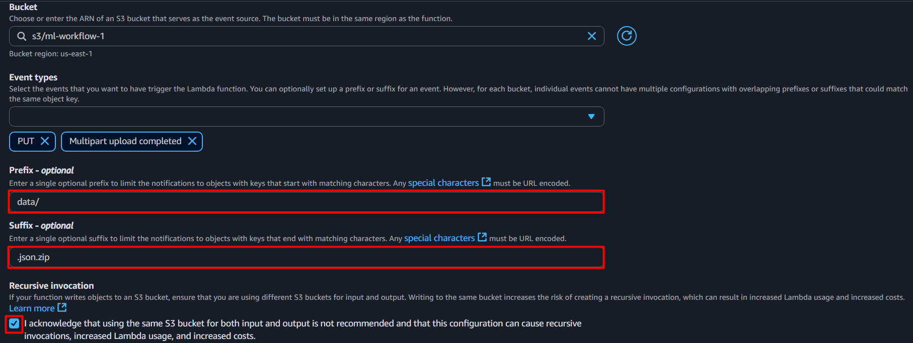

<h1 align="center">Machine Learning Workflow Automation</h1>

<details>
  <summary><h2>Table of Contents</h2></summary>
  <ol>
    <li><a href="#overview">Overview</a></li>
    <li><a href="#aws-lambda">AWS Lambda</a>
    <ul>
        <li><a href="#introduction">Introduction</a></li>
        <li><a href="#lambda-functions">Lambda functions</a></li>
        <li><a href="#invoking-a-lambda-function">Invoking a Lambda function</a></li>
    </ul>
    </li>
    <li><a href="#aws-step-functions">AWS Step Functions</a>
    <li><a href="#epilogue">Epilogue</a></li>
  </ol>
</details>

## Overview
A machine learning (ML) workflow is the structured, end-to-end process of developing and deploying an ML model. The key components of any ML workflow are data collection and pre-processing, model selection, model training and testing, and deployment. It is usually event-driven, meaning the end of one activity provokes the start of the next. 
<p align="center"></p>

As you have practiced the previous tutorial, you are now familiar with executing different components of a machine learning workflow in Amazon SageMaker AI. However, they are done manually and seperately. Additionally, you often need to repeat them multiple times to fix errors, improve your model and achieve desired performance. This process is error-prone and time-consuming. 

In this tutorial, you will learn how to automate these components and chain them together, ultimately forming a seamless ML workflow. By the end of this tutorial, you will be able to:
* Create an ML workflow with AWS Step Functions.
* Automate ML workflows with AWS Lambda.

## AWS Lambda
### Introduction
AWS Lambda is a serverless compute service that runs a single, self-contained function in response to events. It allows you to execute code without specifying underlying infrastructure, like hardware specifications, the operating system, or the maintenance of standard libraries. This service is ideal for small tasks that are frequently repeated.

In the programming realm, it is common to encounter situations where code that works on one machine often fails on another. Even in the managed services like Amazon SageMaker AI, you can still run into failures when running under different configurations. This is not the case in AWS Lambda.

### Lambda functions
A Lambda function is a piece of code that runs in response to events. When invoked, Lambda runs the function handler to process events and return necessary response. The handler function is the entry point of a Lambda function and other AWS services will use it to interact with your code. While the code in a Lambda function can  ontain more than one function, it can only have one handler.

The handler function must match the name and structure expected by the runtime environment. For Python, the function must have:
* Name: `lambda_handler`
* First parameter: `event`, a dictionary containing the event data that triggered the Lambda function.
* Second parameter: `context`, an object provided by AWS Lambda that gives [methods and properties](https://docs.aws.amazon.com/lambda/latest/dg/python-context.html) to access information about the invocation, function, and execution environment.
* Optional response to return, in the form of a dictionary containing status message.

```python
def lambda_handler(event, context):
    # Your code here
    return {
        'statusCode': 200,
        'body': 'Insert your message'
    }
```

In this exercise, you're going to create a basic Lambda function in Python. Then you will deliberately cause it to fail and practice finding error:
1. Head to AWS Lambda using the search bar and in the left navigation sidebar, select *Functions*.
<p align="center"></p>

2. Click on *Create function* button.
3. Select *Author from scratch* option.
4. Enter a unique name for your Lambda function.
5. Under *Runtime*, select a version of Python.
6. Scroll down and click on *Create function* button.
<p align="center"></p>

7. After the function is created, go to the *Test* tab to create a test event.
8. Select *Create new event*.
9. Give the test event a name if you intend to save it. Select *Hello World* as *Template*. There are several test template to simulate other AWS services invoking Lambda function. The select template is merely for basic or custom event simulation, as it doesn't represent any specific AWS service.
10. Leave the default Event JSON and click on the *Test* button to run the test event. You will soon receive a notification showing successful execution and the expected response message from the function. If you want to keep this test event for future experiment, click on the *Save* button.
<p align="center"></p>
<p align="center"></p>

11. Go to the *Code* tab and insert some technical error into your code. Then, click on the *Deploy* button inside the editor to update the function. In this code editor, if you look around, you can see that test events can be created and triggered from here instead.
<p align="center"></p>

12. Go back to the *Test* tab and run the same test event again. You will soon receive a notification showing fail execution and the error message from the function.
<p align="center"></p>

13. However, if an error occurred outside a test environment, e.g. algorithmic error from a processing job, and you want to see what the issue is, go to the *Monitor* tab and and click on *View CloudWatch logs* button. It will direct you to CloudWatch Logs regarding your Lambda function. 
<p align="center"></p>

14. Click through the log of an event you want to investigate and you can see the error message from there.
<p align="center"></p>

### Invoking a Lambda function
There are two types of Lambda function invocation:
* Synchronous invocation will launch the function and expect a immediate response from the function. As a general rule, you'll be invoking Lambda functions synchronously in ML engineering operations.
<p align="center"></p>

* Asynchronous invocation does not wait for a response from the function, and when you submit an event, you are actually submitting it in a queue to be processed. This type of invocations is used when you don't want to have to handle all of the replies, and you may not even need to handle it.
<p align="center"></p>

It is important to keep these two ways of invoking a Lambda function in mind and to consult the documentation to confirm which of these options are available to you.

As seen earlier, a Lambda function is triggered through an event. It is a JSON object, but its structure differs depending on the service sending it. When configuring a service to send events to a Lambda function, consult the AWS documentation to determine the structure of the events your function will process.

To trigger your Lambda function synchronously, you can use AWS SDK or integrate it into workflows using AWS Step Functions. But for now, you will simulate a synchronous invocation with test events, just as you did previously:
1. Go to your S3 bucket and upload the dataset [`reviews_Musical_Instruments_5.json.zip`](../data/reviews_Musical_Instruments_5.json.zip).
2. Modify the code of Lambda function you created earlier so that it acts as a data preprocessing script, similar to the one used in your processing jobs. Alternatively, you can upload [code.zip](./code.zip) provided to override your Lambda function's code. Simply select *Upload from* → *.zip file* and upload the file. Note that the name of the Python file containing the function handler must be `lambda_function.py`, not any name.\
If you decide to implement your own Lambda function, remember to properly define `lambda_handler` function, as your Lambda function will only execute this function. If needed, you can include helper functions in your code. Moreover, your code should directly download the raw dataset using its S3 location extracted from the `event` argument, which will be explained later, and should directly upload training set and testing set into your S3 bucket. These actions requires you to work with AWS SDK for Python, i.e. [`boto3`](https://boto3.amazonaws.com/v1/documentation/api/latest/index.html). Lastly, Lambda function restricts your file operations within the local directory `/tmp/`. Hence, all files created, downloaded, or extracted must be in this folder.
<p align="center"></p>

3. Go to *Configuration* tab, select *General configuration* on the left sidebar. Then select *Edit* on the right.
<p align="center"></p>

4. Under *Timeout*, set it to about 5 minutes. And under *Existing role*, click on *View the role*. This will navigate you to *Identity and Access Management (IAM)* console of your Lamdba function's role.
<p align="center"></p>

5. Since your Lamdba function's role is automatically created, it doesn't have the permission to access S3. Therefore, you have to grant it that permission. From the role console, go to *Add permissions* → *Attach policies*.
<p align="center"></p>

6. Search for *AmazonS3FullAccess* and select it. Scroll down and click on *Add permissions* button.
<p align="center"></p>

7. Go back to the previous browser tab, Lambda function's configuration console, and click on *Save* button.

8. Go to the *Test* tab and create a new test event. This time, select *S3 Put* as *Template*. This will simulate the actual event data that is sent to a Lambda function when a file is uploaded into an observed S3 bucket.
<p align="center"></p>

9. In *Event JSON*, you can see that this is what will be sent to your Lambda function’s handler, via the `event` argument. To match the desired test scenario, replace the text inside the *name* field under the *bucket* field with your S3 bucket name. Also, replace the text inside the *key* field under the *object* field with key name of newly uploaded dataset, not its S3 location as explained in the first tutorial. These are the two values your function handler should extract from the `event` argument. \
Note that the *Records* field in the event payload contains a list, not subfields. This allows AWS S3 to notify a Lambda function about multiple object-related events in a single invocation. In this case, it would be two or more files uploaded simultaneously. Therefore, your code should iterate over this list to handle each record.
<p align="center"></p>

10. Give this test event a name and save it, if necessary. Then, click on the *Test* button to trigger your Lambda function.

After a few minutes, you will receive the notification within the *Test* tab. If it fails, try to fix the problem showed in the notification and in the CloudWatch Logs. If it succeeds, you will be able to see training set and testing set of the new dataset in your S3 bucket.

Next, you will trigger this Lambda function asynchronously with real event:
1. From the Lambda function console, click on the *+ Add trigger* button.
<p align="center"></p>

2. Select *S3* as the source of invocation.
<p align="center"></p>

3. In the *Bucket* field, select your S3 bucket name.
4. In the *Event types* field, deselect *All objects create events* and select *PUT* only. This ensures the Lambda function is triggered only when new objects are uploaded.
<p align="center"></p>

5. In the *Prefix* field, enter the directory path in your bucket where the datasets are expected to be uploaded. This will filter events so that only objects uploaded to that path will trigger the Lambda function.
6. In the *Subfix* field, enter `.json.zip` as this will restrict the invocation to this certain file type.
7. Tick the checkbox in the *Recursive invocation* field. This acknowledgement warns you about the risk of recursive invocations. They happen when your Lambda function is automatically triggered by its own uploads. Specifically, when uploaded files reside in the same bucket and match the prefix as well as the file type you specified in this setting. 
<p align="center"></p>
 
8. Click on *Add* button to finalize the trigger setting.
9. Go to your S3 bucket and upload the dataset [`reviews_Patio_Lawn_and_Garden_5.json.zip`](../data/reviews_Patio_Lawn_and_Garden_5.json.zip) in the directory path you specified earlier. This will soon trigger your Lambda function and you will be able to see the training set and the testing set of the new dataset.

Unlike synchronous invocation, you cannot receive a direct response message from your Lambda function with asynchronous invocation. However, you are still able to inspect error messages in CloudWatch Logs.

<ins>**Please note**</ins>: You are billed for every Lambda function invocation, even if it is a test event. Therefore, refrain yourself from spamming invocations and delete all triggers after you finish your experiment.
<p align="center"></p>

Similarly, you can construct a Lambda function to automate a workflow in AWS Step Functions with invocations.

## AWS Step Functions
### Introduction
AWS Step Functions is a visual workflow service that helps you use AWS services to build distributed applications, automate processes, orchestrate microservices, and create ML workflows.

It is based on two abstractions:
* State machine: serverless workflow, which is a series of event-driven steps.
* Task: a state within a workflow that represents a single unit of work performed by another AWS service.

Advantages:
* Intuitive UI.
* Easy visualization.
* Easy isolation of failure points.

Disadvantages:
* Significantly more expensive than Lambda function.
* Dependent on proprietary Amazon State Language.
* Not compatible with similar orchestration tools in other platforms.

### Creating a workflow
In AWS Step Functions console, you will directly intergrate and chain several microservices of Amazon SageMaker AI in order to construct an ML workflow. This requires a deeper understanding of the [Amazon States Language (ASL)](https://states-language.net/spec.html) to configure each component. 

The Amazon States Language is a JSON-based, structured language used to define your state machine. It mostly resembles a nested dictrionary in Python. It utilizes [JSONata](https://docs.jsonata.org/overview.html) as the default query language. When a state machine execution receives JSON input from execution, it passes that data to the first state in the workflow as input. With JSONata, you can retrieve a state input from `$states.input`. If a state is successfully completed, its API response will be stored in `$states.result`. Furthermore, you can use JSONata to dynamically configure your state machine during each execution.
<p align="center"></p>

In this exercise, you will embedded JSONata expression inside a string value. The expression must start with `` with no trailing spaces. Improperly opening or closing the expression will result in a validation error.
```JSON
""
```
Any JSONata functions or variables must start with the character `$`, e.g. `$states.result` or `$split($variable_1)[0]`. Moreover, because the JSONata expression is in a string value, to add a string into the expression, use the single quote `'` instead of double. Finally, to concatenate string, use the ampersand character `&`, e.g. ``.

For more information, read [this](https://docs.aws.amazon.com/step-functions/latest/dg/transforming-data.html#writing-jsonata-expressions-in-json-strings) and [this](https://docs.aws.amazon.com/step-functions/latest/dg/workflow-variables.html).

No worries, this tutorial will help you set up an ML workflow with ASL along the way:
1. Head to Step Functions using the search bar and in the left navigation sidebar, select *State machines*.
2. Click the *Create state machine* button.
3. In the pop-up window, select *Create from blank*, give a unique name for your state machine, and select *Standard* for *State machine type*. Finally, click on the *Continue* button.
<p align="center"></p>

4. Take a look at the picture below. Now, use the search bar in the left sidebar of the console, find the illustrated states, and drag them onto the graph canvas to create the corresponding workflow. Rename each state as needed.
<p align="center"></p>

5. Click on the first state. In the *Configuration* tab, scroll down and check the option *Wait for task to complete*.
<p align="center"></p>

6. Go to the *Arguments & Output* tab, remove text in the *Arguments* field and write below text instead. You will gradually add more fields to correctly configure this state. For more information about CreateProcessingJob's arguments, go [here](https://docs.aws.amazon.com/sagemaker/latest/APIReference/API_CreateProcessingJob.html).
<p align="center"></p>

```JSON
{
  "ProcessingJobName": "?",
  "RoleArn": "?"
}
```
7. Since the name for new processing job must be unique, you should not hard-code its name in the *ProcessingJobName* field. If a static name is used, the state machine will create processing job with the same name for every execution, which will cause error and disrupt the workflow. Instead, dynamically generate a unique name using JSONata expression. In the *ProcessingJobName* field, enter the leading name of your choice and concatenate it with the function `millis()`. For example, ``. Feel free to use different expression.

8. In the *RoleArn* field, enter the ARN (Amazon Resource Name) of the role you created and used throughout your SageMaker AI experiments in the last tutorial. To do this, head to IAM using the search bar.
       <p align="center"></p>
       In the left navigation sidebar, go to *Access Management* → *Roles*. Then click on the name of the role and you will be able to see its ARN.
       <p align="center"></p>
       <p align="center"></p>

9. Add the field below to set up the resources for the job. Remember to seperate it from the previous field with a comma.
    ```JSON
    "ProcessingResources": {
      "ClusterConfig": {
        "InstanceCount": 1,
        "InstanceType": "ml.m5.large",
        "VolumeSizeInGB": 1
      }
    }
    ```

10. Add the field below to set up the inputs for the job. Remember to seperate it from the previous field with a comma. This field contains a list. Just like before, your processing job will have 2 inputs: raw dataset and Python script. So, this list contains two corresponding elements.
    ```JSON
    "ProcessingInputs": [
      {
        "InputName": "input",
        "S3Input": {
          "S3DataType": "S3Prefix",
          "S3InputMode": "File",
          "S3Uri": "?",
          "LocalPath": "?"
        }
      },
      {
        "InputName": "code",
        "S3Input": {
          "S3DataType": "S3Prefix",
          "S3InputMode": "File",
          "S3Uri": "?",
          "LocalPath": "?"
        }
      }
    ]
    ```
    The first element of the list is for the dataset. Provide its S3 location and local path in the corresponding subfields, *S3Uri* and *LocalPath*. Each execution of the state machine will require you to work with different dataset in different bucket. Thus, you should use JSONata expression to retrieve the S3 location of the dataset from the state input, e.g. ``. Since this is the first state in your state machine, its input will directly be the input of state machine. Later, you will execute your state machine with an input like this:
    ```JSON
    {
    "bucket": "your-bucket",
    "prefix": "s3://your-bucket/data/",
    "dataset": "reviews_Musical_Instruments_5.json.zip"
    }
    ```
    The second element is for the Python script. Provide the S3 location and the local path in the corresponding subfields. No JSONata expression needed.

11. Add the below field. As before, find and enter the registry path of scikit-learn's processing image in the *AppSpecification* field. For the second element of the *ContainerEntrypoint* field, enter the local address to your Python script, e.g. `/opt/ml/processing/input/code/<your_script_name>`. If you use the provided Python code, enter a JSONata expression in the *ContainerArguments* field, which retrieves the dataset name through state input. Otherwise, remove this subfield.
    ```JSON
    "AppSpecification": {
      "ImageUri": "?",
      "ContainerEntrypoint": [
        "python3",
        "?"
      ],
      "ContainerArguments": [
        "?"
      ]
    }
    ```

12. Add the below field to set up the outputs for the job. The *Outputs* field contains a list with two items defining the configuration for the training set and the testing set. In each element, specify where the set should be uploaded in your bucket in the field *S3Uri*, and the local path where your Python script saves the set in the *LocalPath* field. Use JSONata expressions to dynamically determine the S3 output locations from the state input. 
    ```JSON
    "ProcessingOutputConfig": {
      "Outputs": [
        {
          "OutputName": "train_set",
          "S3Output": {
            "S3Uri": "?",
            "LocalPath": "?",
            "S3UploadMode": "EndOfJob"
          }
        },
        {
          "OutputName": "test_set",
          "S3Output": {
            "S3Uri": "?",
            "LocalPath": "?",
            "S3UploadMode": "EndOfJob"
          }
        }
      ]
    }
    ```
13. You have done setting up all required and important arguments for the first state. But you need to define the output of this state so that it will pass the expected S3 locations of the training set and the testing set to the next state in the workflow. Scroll to the *Output* field right below and enter the following:
    ```JSON
    {
      "train": "?",
      "test": "?"
    }
    ```
    In each field, use JSONata expression to contruct S3 location from the state input. The exact object names will depend on how your Python script saves the files. If you are using the provided Python script, use with the following instead:
    ```JSON
    {
      "train": "",
      "test": ""
    }
    ```

14. Go to the *Variables* tab and enter the text shown below to assign the bucket name extracted from this state's input to the variable `bucket`. This variable can be later referenced in subsequent states.
<p align="center"></p>

15. Click on the second state in the workflow. In the *Configuration* tab, scroll down and check the option *Wait for task to complete*.


https://docs.aws.amazon.com/step-functions/latest/dg/transforming-data.html