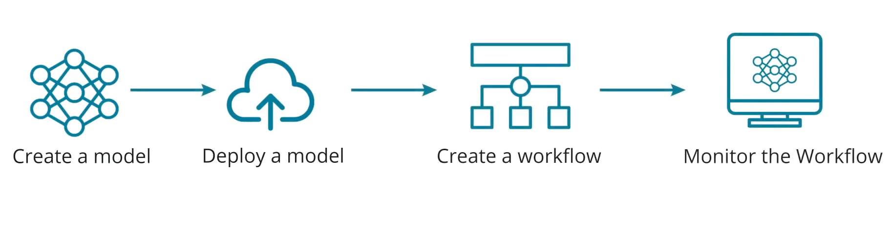
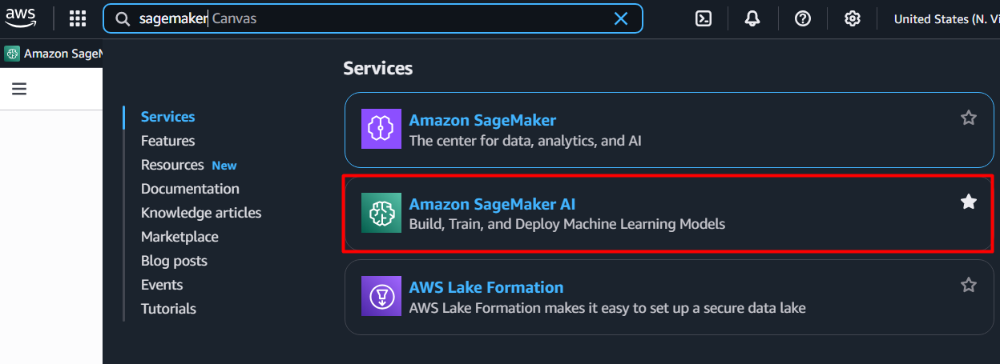
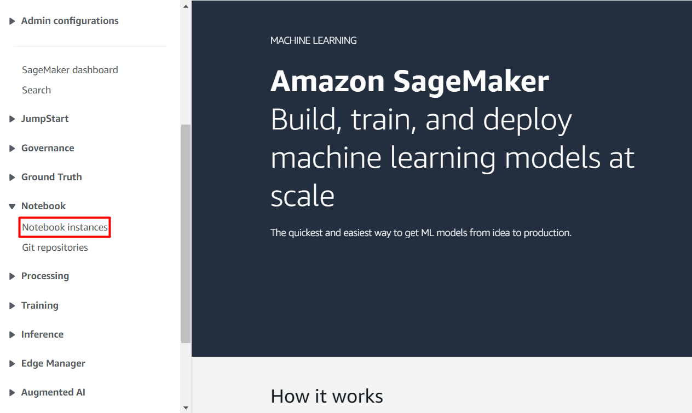
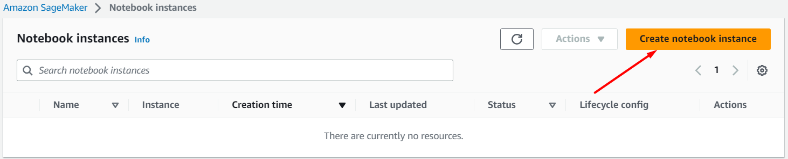
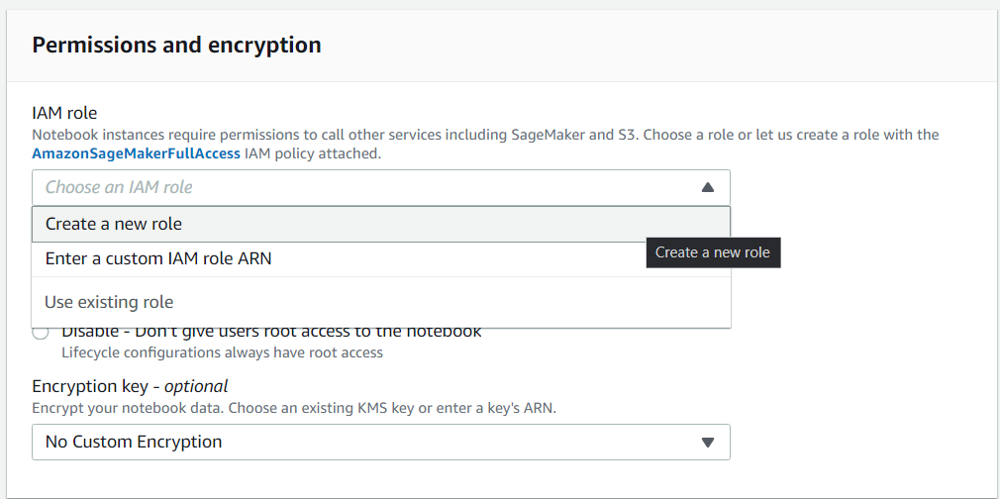
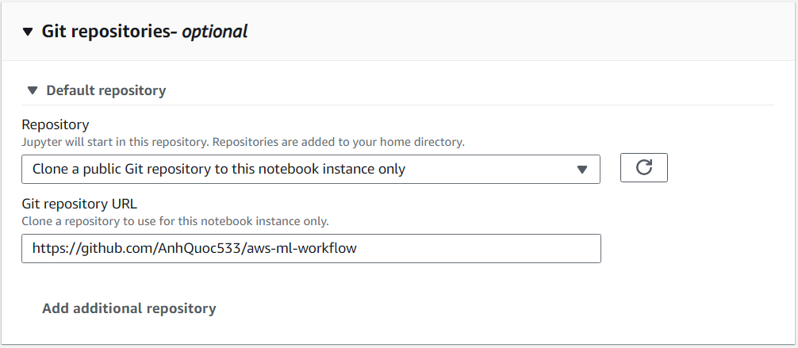

# DEVELOPING MACHINE LEARNING WORKFLOWS WITH AWS
<!-- TABLE OF CONTENTS -->

  
Table of Contents

  <ol>
    <li><a href="#overview">Overview</a></li>
    <li><a href="#aws-introduction">AWS Introduction</a></li>
    <li><a href="#prerequisites">Prerequisites</a></li>
    <li><a href="#getting-started">Getting Started</a></li>
    <li><a href="#attention">Attention</a></li>
  </ol>

## Overview
This repository is a guidebook to developing simple machine learning workflows with Amazon Web Services (AWS). As you dive in, you will learn how to leverage AWS services to build, deploy, and monitor your machine learning models efficiently.

Throughout the tutorial, you will play the role of a machine learning engineer. You will take the work products from other data professionals, such as data scientists and data engineers, and make them production-ready. Therefore, your job will involve developing ML models, deploying them as APIs, automating ML workflows, and monitoring ML systems in real-time. 

Overall, this repository covers the following topics:
* Introduction to Amazon SageMaker.
* Machine learning workflows automation.
* Workflow monitoring.
  

## AWS Introduction
AWS (Amazon Web Services) is an on-demand cloud computing platform that offers a broad set of products and services, which also include machine learning, to help organizations move faster, lower costs, and scale. With the machine learning services in AWS, you can accelerate the ML development process and improve the reliability and security of your ML workflows.\
AWS is a pay-as-you-go service, which means that you only pay for the services that you use.

There are three main ways to interact with services in AWS:
* **AWS Management Console**: a web-based user interface that provides easy access to all of services. It is the best way to get started with AWS services and a good option for users of all skill levels. It is generally used for debugging and initial setup.
* **AWS Software Development Kits (SDKs)**: libraries that allow you to *programmatically* interact with AWS services from your own applications. They are available for a variety of programming languages and are a good option for developers who want to build applications that use AWS.
* **AWS Command Line Interface (CLI)**: a tool that allows you to interact with AWS services using a command-line interface. It is more powerful than the console, but it also requires more technical knowledge to use and is hard to handle. It is generally used for one-off jobs.

This tutorial covers only two of the mentioned approaches (AWS Console and AWS SDKs) in each topic.

## Prerequisites
To practice with this repository, you need:
* Intermediate Python programming skills.
* Basic machine learning knowledge.
* Familiarity with Jupyter Notebook.
* **An AWS account.** \
_You can create an AWS Free Tier account via https://aws.amazon.com/free._ 

## Getting Started
In order to start practicing, you need to clone this repository to your Amazon SageMaker:
1. Log into your AWS Console.
2. Navigate to Amazon SageMaker through the search bar, or click [here](https://console.aws.amazon.com/sagemaker/home#/notebook-instances) and skip to step 4. Bookmarking this service is recommended.
   
3. In the left sidebar, go to Notebook → Notebook instances.
   
4. Click _Create notebook instance_.
   
5. Type in the notebook instance name of your choice.
6. In the _Permissions and encryption_ option, click on the dropdown and choose _Create a new role_ for operating SageMaker and S3 if you don't have one or this is your new experience.
   
7. Leave the setting as is and click _Create role_.
8. In the _Git repositories_ option, choose _Clone a public Git repository to this notebook instance only_ and paste the URL of this Git repository in the second Amazonbox.
   
9. That's it. Let's finalize the process.

When the notebook status shows _InService_, click _Open Jupyer_ and begin your learning. \
<u>**Please note**</u>, to completely shut down your notebook in Amazon SageMaker, navigate to the _Notebook instances_ page, select the running notebook, and stop it through the _Actions_ dropdown button. This is extremely important to avoid **unwanted charges**.

## Attention
*  The tutorial in this repository _may_ be outdated due to future updates of AWS. In some cases, this may change the way the features are accessed or appear on the console. But in most cases, the generic workflow progression will remain the same.
  
* Always remember to clean up all resources, especially Amazon SageMaker, immediately after use or if you are stepping away. Any service available to you at $0.1/hour or higher should be monitored closely. Moreover, bear in mind that there is a limited amount of AWS budget allocated in the Free Tier account if you are using this option.\
  To better understand pricing, see [AWS Pricing](https://aws.amazon.com/pricing) and scroll down to _Pricing for AWS products_. \
  To track your usage, go to [AWS Billing Dashboard](https://console.aws.amazon.com/billing/home#/bills).